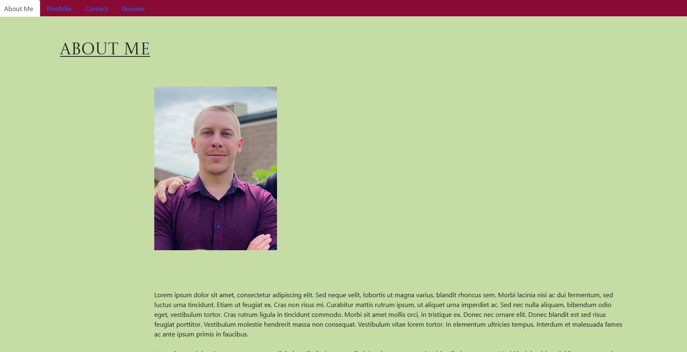

# react-portfolio-redux

## Description

The motivation behind this project was to practice and clarify concepts and understanding related to the use of basic techniques in React to create a portfolio webpage built from dynamically created React components and deployed as a functioning React App on Github Pages. This required significant learning around the use of React and it's methods. What I have produced in the end fulfills the technical requirements, but requires more work going forward to make it more attractive and more reflective of my general CSS skills. Unfortunately, right now I have no time for further refinement and it will have to remain on the backburner until I finish the course.

## Table of Contents

- [Description](#description)
- [Usage](#usage)
- [Deployment](#deployment)
- [Credits](#credits)
- [License](#license)

## Installation

Once downloaded run npm i to install the required components, then run npm start.
Otherwise - view it on Github Pages.

## Usage

When the User visits the portfolio site, they will be greeted by a dynamically generated React App, that allows them to:
Read about me (info coming soon), visit links to various projects I have completed throughout my learning, fill in a contact form (backend coming soon) and view my resume.

## Deployment

Screenshot:

https://tvml24.github.io/react-portfolio-redux/#aboutme

## Credits

This project makes use of code from the bootcamp activities - although modified for this purpose.

It also makes use of nodeJS, ExpressJs, React and GH-Pages among others.

The rest is my own work.

Credit also to my teachers, as without them this would not have been possible.

## License

Licensed under the MIT license.

